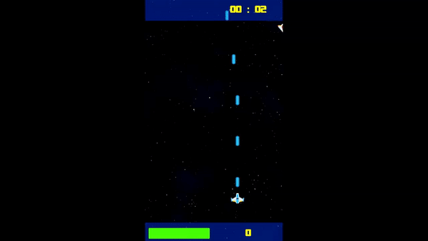
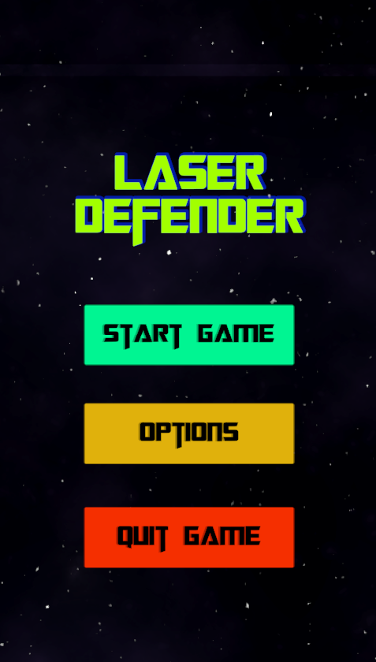
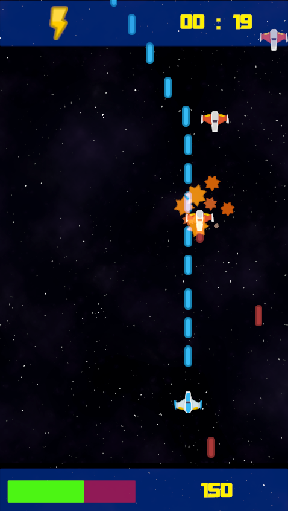
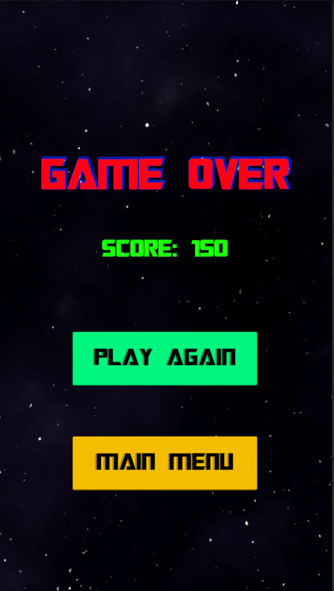
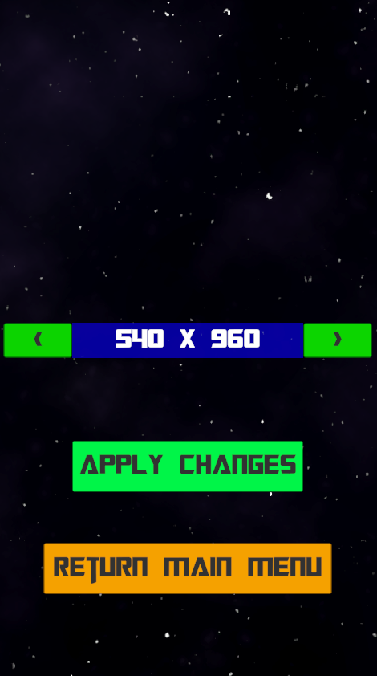

# LaserDefender

Game project that was made in GameDevTV 2D Course. I also added timer and powerups.

## Play

You can check [release page](https://github.com/mustafaHTP/LaserDefender/releases)

## Controls

Move → Keyboard arrows

Fire → Space

## Screenshots

---

---

---
